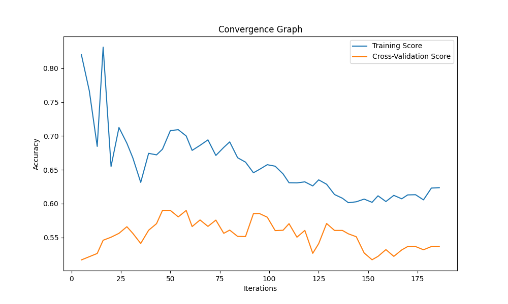

# Assignment: Parameter Optimization

# SVM Hyperparameter Tuning using Genetic Algorithm

This project aims to optimize the hyperparameters of a Support Vector Machine (SVM) classifier using a Genetic Algorithm (GA). The dataset used for this task is the Heart Disease dataset from the UCI Machine Learning Repository.

## Methodology

1. **Data Preprocessing:**
   - The dataset is first loaded from the provided link and missing values are dropped.
   - Standard scaling is applied to normalize the feature values.

2. **Data Splitting:**
   - The preprocessed dataset is split into training and testing sets using a 70-30 ratio.
   - This process is repeated 10 times with different random states to generate multiple samples.

3. **Genetic Algorithm:**
   - The GA is used to search for optimal hyperparameters for the SVM classifier.
   - The hyperparameters considered for optimization are:
     - Kernel type: Linear, Polynomial, RBF, Sigmoid
     - Regularization parameter (C)
     - Kernel coefficient (Gamma)
   - The fitness function used is the accuracy score of the SVM classifier on the testing set.

4. **Results:**
   - The GA is run for each sample, and the best hyperparameters along with their corresponding accuracy scores are recorded.
   - The convergence graph is plotted based on the hyperparameters that yield the highest accuracy score across all samples.
 
## Results

The GA was able to find the following optimal hyperparameters and corresponding accuracy scores:

| _Sample_ | _Best Accuracy_ | _Best Kernel_ | _Best Nu_ | _Best Epsilon_ |   |
|---------:|----------------:|--------------:|----------:|---------------:|--:|
|        1 |            0.56 |       sigmoid |      0.22 |           4.48 |   |
|        2 |            0.59 |        linear |      0.43 |           7.51 |   |
|        3 |            0.53 |           rbf |      6.47 |           0.34 |   |
|        4 |            0.56 |           rbf |      7.12 |           6.25 |   |
|        5 |            0.58 |       sigmoid |      1.12 |           4.61 |   |
|        6 |            0.54 |       sigmoid |      1.70 |           4.22 |   |
|    **7** |        **0.67** |    **linear** |  **0.04** |       **7.35** |   |
|        8 |            0.52 |        linear |      2.72 |           3.01 |   |
|        9 |            0.57 |       sigmoid |      8.30 |           8.20 |   |
|       10 |            0.52 |       sigmoid |      2.04 |           5.33 |   |

The convergence graph illustrates the relationship between the number of iterations and the accuracy scores for the best hyperparameters found.
 

## Conclusion

The Genetic Algorithm proved to be effective in optimizing the SVM hyperparameters, resulting in improved accuracy scores on the Heart Disease dataset. This approach can be further explored and extended to other classification tasks with different datasets
